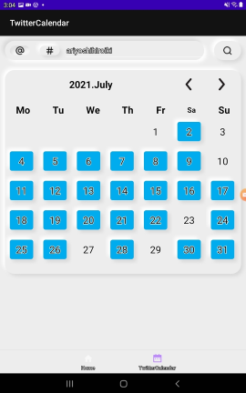
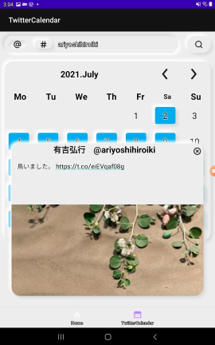
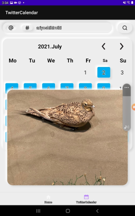
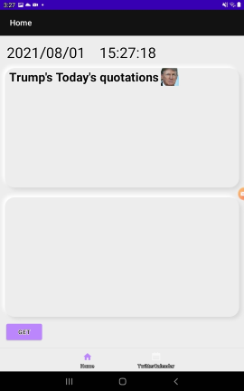
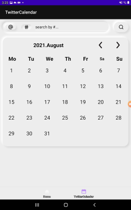
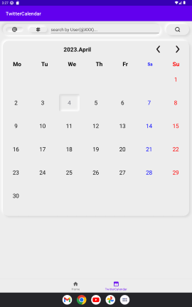
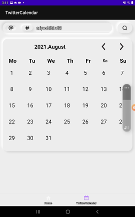
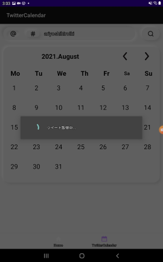
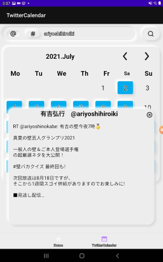
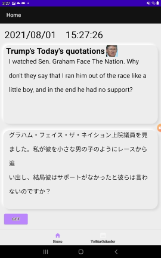

     

# 📆Twitter Calender (and more)
**Twitter Calender** : Get Tweet and displaed on your calendar  
**and more** :  Auto translation of tweets


## 🎥 Demo
[Here](https://drive.google.com/file/d/13uIKGhTFoB1R1G2vGSxWSgBkmj4R48yu/view?usp=sharing)is a demonstration video.  

Extra function is [here](https://drive.google.com/file/d/1Dp1n2y-AsZFSq-1zezrkrDRsdkBQucgy/view?usp=sharing).

## My other portfolio is here
- 📝[Canvas](https://github.com/TatsuyaHasunuma0123/Canvas)
- 🎵[Msuic Player](https://github.com/TatsuyaHasunuma0123/MusicPlayer)
- 🕸️[Discussion Web](https://github.com/TatsuyaHasunuma0123/Discuss)

## Usage
- Install the latest version from the [official AndroidStudio app](https://developer.android.com/studio). 
- **clone** this repositories and open project with AndroidStudio.  
```
git clone https://github.com/TatsuyaHasunuma0123/TwitterCalender
```
- Create **Twitter API** account from [here](https://developer.twitter.com/en/docs/twitter-api/getting-started/getting-access-to-the-twitter-api).
- Declaring Dependency to [Twitter4J](https://twitter4j.org/)
- Declaring Dependency to Twitter4J
```
dependencies {
    compile 'org.twitter4j:twitter4j-core:4.0.7'
}
```
- create `main/resorces/twitter4j.properties` and set key and token
```
debug=true
oauth.consumerKey=XXXXXXXXXXXXXXXX
oauth.consumerSecret=XXXXXXXXXXXXXXXXXX
oauth.accessToken=XXXXXXXXXXXXXXXX
oauth.accessTokenSecret=XXXXXXXXXXXXXXXX
```

## Design
   
### Neumorphism 
- https://github.com/fornewid/neumorphism  
- Neumorphism is a visual trend that has gained traction with UI/UX designers and become a popular aesthetic choice for contemporary software, websites, and mobile apps.


## Functions
### Get Tweets
   
  

1. You can get any tweets from user name  or　hashtag.(Top of the screen)
2. Please wate a minutes
3. The calendar for the date the tweet was retrieved will turn blue
4. Press blue button and displayed the tweet
5. You can scroll window that displayed


### Get Random Tweet  【😁 this is a extra function】 
  
   
- Randomly retrieve Donald Trump tweets and translate them into Japanese,
- I use API called [tronalddump](https://www.tronalddump.io/)
- Automatic translation into Japanese was done using [GAS](https://developers.google.com/apps-script/api/reference/rest?hl=ja)

